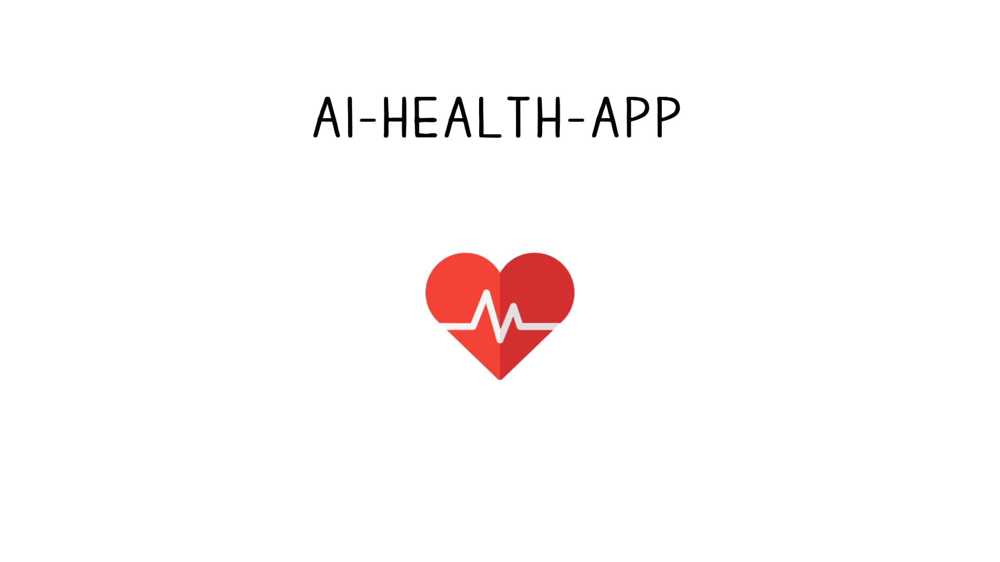

<h1 align="center"> AI HEALTH APP </h1>

  

A web application that uses computer vision and artificial intelligence technologies to analyze faces from photographs and assess users' health status.

## 💡 Project idea
The user visits the website / application / telegram bot, uploads a photo or video, the service processes the data, and then issues a report on the user's health.

## ⚙️ Technology stack

### **Backend**
- Python 3.13.7
- FastAPI
- Uvicorn
- Scikit-Learn
- TensorFLow
- Aiogram 3 (asynchronous framework for Telegram bots)
- Asyncio/Aiohttp/Aiofiles (asynchronous operations)

### **Frontend**
- soon

 
 
 

> **Have a nice day!** 🍀